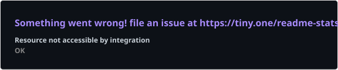
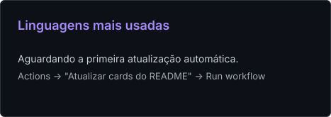

<!--
  README de perfil — Johnny de Sá (john065)
  Contato principal: johnny@difery.com
  Visuais animados (assets/*.svg): python3 scripts/gerar_visuais.py
-->

<picture>
  <source media="(prefers-color-scheme: dark)" srcset="./assets/header-dark.svg">
  <source media="(prefers-color-scheme: light)" srcset="./assets/header-light.svg">
  
</picture>

  

 

Sou **Johnny de Sá**, empreendedor. Aprendi gestão na prática, tocando negócios, lidando com rotina, números e decisões de verdade, e hoje transformo essa vivência em produto.

Trabalho com **tráfego pago** e **automações** e estou construindo a **Difery**. Antes de pensar em tela, penso em quem vai usar o sistema numa segunda-feira de manhã.

 

## 🚀 Atualmente construindo

<picture>
  <source media="(prefers-color-scheme: dark)" srcset="./assets/projeto-dark.svg">
  <source media="(prefers-color-scheme: light)" srcset="./assets/projeto-light.svg">
  
</picture>

Mais detalhes em breve.

 

## 🛠️ Meu ecossistema

<picture>
  <source media="(prefers-color-scheme: dark)" srcset="./assets/ecossistema-dark.svg">
  <source media="(prefers-color-scheme: light)" srcset="./assets/ecossistema-light.svg">
  
</picture>

 

## 🧠 Como penso IA e automação

- **Processo antes de ferramenta.** Primeiro entendo como a empresa funciona de verdade, depois automatizo.
- **IA com contexto.** Respostas baseadas nos dados do negócio, não em suposições genéricas.
- **Tudo conectado.** Sistemas, canais e dados que conversam entre si, em vez de ilhas de informação.
- **Decisão orientada a dados.** A mesma lógica que aplico no tráfego pago: medir, ajustar e repetir.

 

## 📊 Atividade no GitHub

<!-- Cards gerados diariamente por .github/workflows/readme-cards.yml, dentro do próprio repositório. -->

  <picture>
    <source media="(prefers-color-scheme: dark)" srcset="./profile/stats-dark.svg">
    <source media="(prefers-color-scheme: light)" srcset="./profile/stats-light.svg">
    
  </picture>
  <picture>
    <source media="(prefers-color-scheme: dark)" srcset="./profile/top-langs-dark.svg">
    <source media="(prefers-color-scheme: light)" srcset="./profile/top-langs-light.svg">
    
  </picture>

 

## 🤝 Vamos conversar

Gestão, automação, IA ou empreendedorismo: se é sobre resolver problemas reais de empresas, quero ouvir.

**[johnny@difery.com](mailto:johnny@difery.com)**

 

<picture>
  <source media="(prefers-color-scheme: dark)" srcset="./assets/rodape-dark.svg">
  <source media="(prefers-color-scheme: light)" srcset="./assets/rodape-light.svg">
  
</picture>
